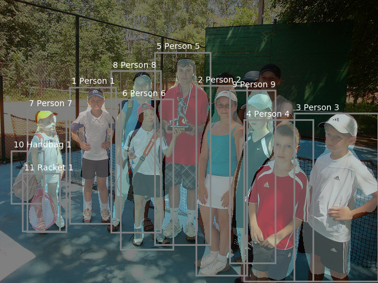
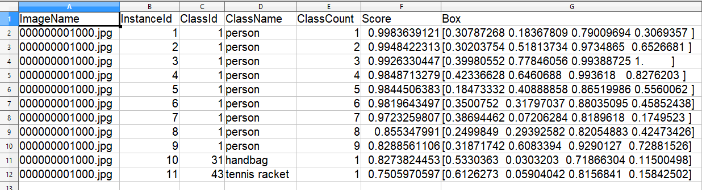

# Annomator

### Annomator is a fully featured automatic image annotator.  

Copyright 2019 Annomator.  Written by Arend Smits.  All Rights Reserved.  

Copyright 2019 The TensorFlow Authors.  All Rights Reserved.

Licensed under the Apache License, Version 2.0 (the "License"); you may not use this file except in compliance with the License.  You may obtain a copy of the License at http://www.apache.org/licenses/LICENSE-2.0.  Unless required by applicable law or agreed to in writing, software distributed under the License is distributed on an "AS IS" BASIS, WITHOUT WARRANTIES OR CONDITIONS OF ANY KIND, either express or implied.  See the License for the specific language governing permissions and limitations under the License.

Annomator is designed to detect, record and display objects found in pictures.  It comes pretrained to detect 80 objects including people, vehicles, animals, food, home, office and sports (MSCOCO 80 categories).  It was originally designed for scientific data collection but can be trained on new objects including individuals, plant or animal species, cells and can process any images including microscope, phone, drone and telescope.  It can be used to analyse drone transect data or pick out a person in a crowd.  It includes quantified and summarised data for easy input straight into office and can be interpreted visually by an untrained user.  

The data is stored in a number of formats including a pure image semantic encode and several codecs have been included.  It is currently the only semantic encoder known to exist.  Visual ouput can be png, jpg or pdf.  Output can also be individual and a summary text file in txt, csv or json format that include box coordinates.  These can be checked and edited and a summary file produced for export to another program.  Gimp can be used to check and edit the results.  Open Office can import into a spreadsheet or database for further analysis, removing the need for specific machine learning support.

The images can be batch processed to appear like the following:

All the above data can be derived from a single png image:

The output can also be summarised to a text file for import into Office:

Images can also be annotated or 'painted' to achieve new training data.  It also includes a full panoptic codec so that background and textures can be included in the training data.  Gimp or Photoshop can be used as the image editor and instructions will be made available on each section where required.  If you want to detect new objects and have no machine learning skills, it is recommended you seek professional help.  

The workflow may include annotating the images and then labelling them for further training.  Some examples would be to annotate for people and then label them with their names.  Microscopy cells or planets could be detected as 'balls' and then annotated.  These can then be used for training.  

###### There are too many features to list but the package contains:
- Unique detection and annotation to a user friendly output
- Several new codecs for semantic (per pixel) image processing
- Ability to annotate automatically then edit or start annotating manually
- Training modules for box or semantic encoding
- Smart restart so that it can be stopped and started efficiently without repeating images
- Image preprocessor for fast, efficient detections and possible training
- Individual text and summaries for easy import into spreadsheet or database
- All functions are available using open source programs
- Runs on most Linux, Mac and Windows computers

The easiest way to get started is to pip install the requirements in the setup folder.  No other files are required to run Annomator.  Annomator has been tested on Linux, Mac and Windows and uses Tensorflow 1.5.0 and Tensorflow Slim at its core.  The install will use these but you are invited to try the official install instruction and your current version of Tensorflow.  It is compatible with Python 2.7 to 3.7 and tested up to Tensorflow 1.10.  Note you will need to move the train.py file out of the legacy folder if using the latest official install.  The only required installs are Tensorflow, PIL and Matplotlib.  Jupyter is only used for instructions so is useful but not necessary.  A virtual environment is recommended but not necessary.

We are always seeking to make Annomator better.  Please send feedback to annomator@gmail.com and let us know if you found the package useful and how it was used.  If you have machine learning skills and are familiar with Annomator, please let us know as we are still seeking consultants for most universities and other commercial applications.  Tensorflow, Tensorflow Slim, Tensorflow Object Detection, Annomator and the associated codecs are all protected under the Apache 2 licence.  Please contact annomator@gmail.com for commercial use.  